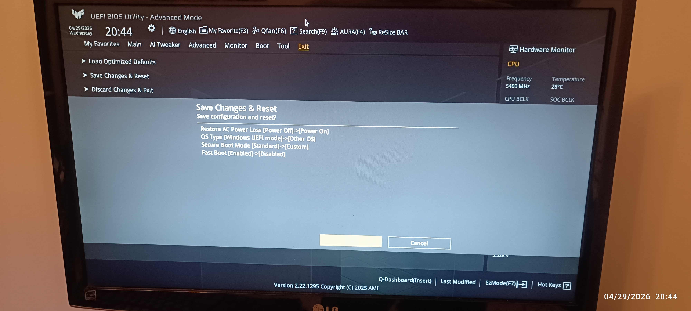

# Personal Server Setup Guide (Ubuntu 24.04 LTS, NVIDIA, Xorg)

Reproducible end-to-end setup for a single-user personal server running Ubuntu 24.04 LTS on NVIDIA hardware (RTX 5090 confirmed), with remote-desktop access via TeamViewer over a router DMZ to the public internet.

Every numbered section has a corresponding script under [`scripts/`](./scripts/). Run them in order, one at a time, after a fresh OS install. The scripts are defensive: each one validates its preconditions, fails loud on anything unexpected, never silently. Re-running a finished step is a no-op (idempotent).

This guide is intentionally **Xorg-only**. Wayland is not supported. See [§0](#0-why-xorg-only).

Every package and downloaded asset is **pinned to an exact version** in [`scripts/lib/versions.sh`](./scripts/lib/versions.sh). Same input → same output. To upgrade a component, edit one line there. See [§0a](#0a-version-pinning).

---

## Hardware prerequisites (read this first)

This box is a hybrid-graphics build: discrete NVIDIA GPU (RTX 5090) **plus** a CPU with an integrated GPU (iGPU). **Both are required**, and they have non-interchangeable roles.

**The monitor — and the EDID DisplayPort emulator from [§15](#15-edid-displayport-emulator-hardware) — must be plugged into the motherboard's video output, NOT the GPU's.** Repeat: cable into the motherboard's back-panel HDMI/DisplayPort, not the RTX's outputs.

Reasons this matters:

- With the display on the iGPU, the desktop renders through the iGPU and the NVIDIA card stays **idle** for compute. This is what makes the [§0](#0-why-xorg-only) measurement of "Xorg uses ~4 MiB of VRAM" hold true. Cable into the GPU instead and Xorg starts eating real VRAM and contending with compute workloads for the card's 1.79 TB/s memory-bandwidth budget — bandwidth that exists to feed the GPU's compute units, not to draw a stationary login screen at 60 Hz.
- With no iGPU at all (Intel "F" SKUs like `13900KF`, AMD CPUs without integrated graphics, or anything pre-iGPU), this guide does not apply — graphics will be forced through the discrete GPU and the [§0](#0-why-xorg-only) VRAM and bandwidth math breaks. Pick a CPU with an iGPU, or accept the cost.

After install, sanity-check that you got it right: `nvidia-smi` should show **only the Xorg process at a few MiB**, no real workload on the GPU at idle, and `xrandr --listproviders` should list the Intel iGPU as the primary provider for the desktop.

---

## 0. Why Xorg only

**You really want to be on Xorg, not Wayland, on this kind of box.** Two reasons:

1. **Ubuntu has already decided this for us.** Since `gdm3 46.2-1ubuntu1~24.04.1` (in `noble-updates` from 2025-01-20 onward), gdm3 ships [`Prefer-Xorg-for-all-Nvidia-versions.patch`](https://bugs.launchpad.net/ubuntu/+source/gdm3/+bug/2080498) which forces Xorg as the default user session for any NVIDIA driver ≥ 510. The 595 driver this guide installs matches that rule, so Ubuntu writes `PreferredDisplayServer=xorg` into the runtime GDM config at every boot. Fighting it is fragile and pointless.

2. **Wayland breaks unattended remote-desktop, and the only workaround is invasive.** TeamViewer connects to the X server directly under Xorg. Under Wayland it goes through `xdg-desktop-portal`'s `RemoteDesktop` / `ScreenCast` consent dialog on every connection — and the freedesktop spec's only persistence mechanism is a single-use `restore_token` that gets invalidated on any display-topology change (e.g., HDMI hotplug, EDID change). Far too fragile for a real headless server.

   I wrote and extensively audited the workaround: **[BigBIueWhale/ubuntu_patch_unattended_access](https://github.com/BigBIueWhale/ubuntu_patch_unattended_access)**. It's a source-level rebuild of `xdg-desktop-portal-gnome` that auto-clicks "Share" on every consent dialog (plus auto-picks the first monitor and force-enables "Allow Remote Interaction"). **It works.** I have it running on my other personal server. I would still not recommend it on a DMZ-exposed box. Lessons from the audit, so you can decide for yourself:

   - The patch auto-approves **every** caller of `org.freedesktop.impl.portal.RemoteDesktop` / `ScreenCast`, not just TeamViewer. The GNOME backend uses `app_id` only for the dialog *heading text*, never for any access decision — so there is no scoping mechanism the patch could leave intact even in principle. Any flatpak or snap you ever install gains silent screen-capture and keystroke-injection through the portal, with no UI prompt. On stock GNOME the same flatpak would have to social-engineer you into clicking Share.
   - The patch is a `meson` source rebuild against the matching upstream tag, then `ninja install` over `/usr/libexec/xdg-desktop-portal-gnome`. It must be `apt-mark hold`-pinned, otherwise the next `apt upgrade` of `xdg-desktop-portal-gnome` silently reverts it. Forgetting the hold across point releases also risks ABI breakage if `libgtk-4` / `libadwaita` change the dialog APIs the patch hooks into.
   - It only ever matters if you're on Wayland in the first place. The portal is a session-bus service, never reachable from the network — so a remote attacker who has not already obtained code execution as the desktop user cannot hit it whether the patch is on or off.
   - Reversible in one shot via `sudo apt install --reinstall xdg-desktop-portal-gnome`, then `sudo apt-mark unhold xdg-desktop-portal-gnome`.

   The trade is: take on attack surface (any local untrusted process can silently screen-cast + inject input) to gain a feature that simply *exists by default* on Xorg. There is no upside on this hardware. **Stay on Xorg.**

VRAM cost of Xorg on this hardware is negligible: measured ~4 MiB on idle RTX 5090 — but **only because the display is wired into the iGPU's motherboard output** (see [Hardware prerequisites](#hardware-prerequisites-read-this-first) above). The desktop renders through the Intel iGPU and the NVIDIA card stays free for compute. Cable into the GPU instead and the "Xorg eats VRAM" folklore becomes real.

The first runtime check in this repo — [`scripts/02_validate_xorg_session.sh`](./scripts/02_validate_xorg_session.sh) — refuses to proceed if `XDG_SESSION_TYPE` is anything but `x11`. Run it after every login before doing anything else.

---

## 0a. Version pinning

Every apt package and every downloaded asset is pinned in [`scripts/lib/versions.sh`](./scripts/lib/versions.sh):

| Component | Pin |
|---|---|
| NVIDIA driver branch + full version | `nvidia-driver-595-open = 595.58.03-0ubuntu0.24.04.1` |
| CUDA Toolkit | `cuda-toolkit-13-0 = 13.0.3-1` |
| Docker CE + plugins | `docker-ce = 5:29.4.1-1~ubuntu.24.04~noble` (and matching cli/containerd/buildx/compose) |
| NVIDIA Container Toolkit | `nvidia-container-toolkit = 1.19.0-1` (and matching libs) |
| TeamViewer | `15.76.5` (version-specific dl.teamviewer.com URL + SHA-256) |

Install scripts source this file via `load_versions` (in [`scripts/lib/common.sh`](./scripts/lib/common.sh)) and pass the pins straight into `apt-get install -y package=version`. Downloads are SHA-256-verified against the same pins.

This means: a fresh install on the exact same Ubuntu 24.04 LTS lands at the exact same software stack as the reference machine. **No drift.**

To upgrade a component:

1. Edit the pin in `scripts/lib/versions.sh`.
2. Re-run the corresponding install script.
3. Re-run [`network_security/verify_network_security.py`](./network_security/verify_network_security.py) to confirm posture is unchanged.
4. Commit.

The NVIDIA driver branch is overridable via the `DRIVER_BRANCH` env var (e.g., `sudo DRIVER_BRANCH=600 bash scripts/07_install_nvidia_driver.sh`). When overridden, the per-package version pins are intentionally skipped — opting into a different branch is opting out of pinning, with a warning logged.

---

## 1. BIOS / UEFI Settings

[](./bios_settings.jpg)

Set these in your BIOS before installing Ubuntu. The screenshot above (also at [`bios_settings.jpg`](./bios_settings.jpg) — click to open full-size) shows them on an ASUS Z890 board; equivalent settings exist on other vendors.

| Setting | Value | Why |
|---|---|---|
| `Restore AC Power Loss` | **Power On** | Server boots automatically after a power outage. |
| `OS Type` | **Other OS** | Avoids Microsoft-key-only Secure Boot enforcement on ASUS boards. |
| `Secure Boot Mode` | **Custom** | With keys cleared, Secure Boot is effectively off — required for the NVIDIA proprietary kernel module to load without signature workarounds. |
| `Fast Boot` | **Disabled** | Gives the OS firmware enough time to enumerate the GPU; some boards drop the discrete GPU from POST under Fast Boot. |

Save and exit, then install Ubuntu.

---

## 2. Operating System

Install **Ubuntu Desktop 24.04 LTS** from the official ISO.

### Reference inputs (version pins for auditability)

These are the exact bytes used to bootstrap this box. Pinned for byte-level reproducibility. The README does not cover *how* to download or write them — that is your problem and there are a thousand tutorials. The point here is that anyone re-running this guide can verify they started from the same inputs.

| Asset | File | Size (bytes) | Released | URL | SHA-256 |
|---|---|---|---|---|---|
| Ubuntu installer | `ubuntu-24.04.3-desktop-amd64.iso` | 6,345,887,744 | 2025-08-07 | `https://releases.ubuntu.com/24.04.3/ubuntu-24.04.3-desktop-amd64.iso` | `faabcf33ae53976d2b8207a001ff32f4e5daae013505ac7188c9ea63988f8328` |
| USB writer (Windows) | `rufus-4.9.exe` | 2,102,632 | 2025-06-15 | `https://github.com/pbatard/rufus/releases/download/v4.9/rufus-4.9.exe` | `497f796e6d076d4855d697965c04626e6d3624658fce3eca82ab14f7414eede2` |

Authoritative SHA-256 sources: the Ubuntu ISO digest is published at `https://releases.ubuntu.com/24.04.3/SHA256SUMS` (signed by `SHA256SUMS.gpg` against Ubuntu CD Image Automatic Signing Key `0xD94AA3F0EFE21092`); the Rufus digest is published in the GitHub release asset metadata at `https://github.com/pbatard/rufus/releases/tag/v4.9`. Both files were verified byte-for-byte against those sources during the reference setup.

A later 24.04.x point release will also work — point releases just bundle accumulated `noble-updates` — but `24.04.3` is the verified-working starting point that these scripts and pins were validated against.

### Live-image install steps

Boot from the USB stick. In the live-image session before installation:

1. **When prompted *"a newer installer is available — Update?"*, click yes.** The updater pulls a newer `ubuntu-desktop-installer` snap. This is fine; it does NOT change the default-display-server policy or the resulting software stack — that's decided post-install by the gdm3 udev rule from [§0](#0-why-xorg-only), regardless of installer version. (We confirmed this empirically during the reference setup.)
2. Choose **"Erase disk and install Ubuntu"** for the install method (this guide assumes a single-purpose box, no dual-boot).
3. Check **"Install third-party software for graphics and Wi-Fi hardware and additional media formats"**. This is critical — it pulls in:
   - **The NVIDIA proprietary driver** out of `multiverse` (the `nvidia-driver-XXX-open` metapackage on the current branch — 595 at time of writing). Without this, the install lands on `nouveau` and `nvidia-smi` is unavailable until you run [§9](#9-nvidia-driver-and-dkms) by hand.
   - **Wi-Fi and Bluetooth firmware blobs** that are not in `main`.
   - **Restricted media codecs** (MP3, AAC, H.264 userland) for desktop usability.

   You'll still run [§9](#9-nvidia-driver-and-dkms) afterwards to add DKMS and pin the driver branch — the third-party checkbox installs the driver but does NOT install DKMS, which is what makes the kernel module survive kernel upgrades.

After install completes and the box reboots:

- The session lands at **Xorg automatically.** This is the gdm3 udev rule from [§0](#0-why-xorg-only) detecting the now-loaded `nvidia` kernel module and writing `PreferredDisplayServer=xorg` into `/run/gdm/custom.conf` at every boot. You don't have to do anything to get here — it's the default for any NVIDIA-on-noble-updates install since 2025-01-20. Verify with [§4](#4-validate-xorg-session) before proceeding.
- The **GDM greeter (the login screen itself), however, is still Wayland by default** — that's a separate decision from the user-session policy. TeamViewer needs the greeter reachable too, and you'd be locked out remotely if autologin ever fails. We patch that in [§5](#5-gdm-greeter-on-xorg) by uncommenting `WaylandEnable=false` in `/etc/gdm3/custom.conf`.

After the first reboot, log into your account, open a terminal, and clone this repository to start running the numbered scripts.

---

## 3. Install Claude Code CLI

This is the first install step on purpose. Once Claude Code is running, Claude itself can guide the rest of the setup — read this README, execute the numbered scripts, answer "what does this do and why" turn by turn.

```bash
bash scripts/00_install_claude_code.sh        # run as the desktop user, NOT sudo
```

Reference: [`scripts/00_install_claude_code.sh`](./scripts/00_install_claude_code.sh). Five idempotent sub-steps:

1. Install via Anthropic's official binary installer at `https://claude.ai/install.sh` — lands the binary at `/home/<user>/.local/bin/claude`.
2. Ensure `/home/<user>/.local/bin` is on `PATH` in `/home/<user>/.bashrc` (skipped if any existing `export PATH=` line already references `.local/bin`).
3. Append a marker-bracketed env block to `/home/<user>/.bashrc` with the three exports that lock in maximum thinking effort on Opus 4.8 (1M context): `CLAUDE_CODE_EFFORT_LEVEL=max`, `ANTHROPIC_MODEL='claude-opus-4-8[1m]'`, `CLAUDE_CODE_MAX_OUTPUT_TOKENS=128000`.
4. Merge five managed keys into `/home/<user>/.claude/settings.json` — `model`, `effortLevel: "xhigh"`, `showThinkingSummaries: true`, plus `env.CLAUDE_CODE_EFFORT_LEVEL=max` and `env.CLAUDE_CODE_MAX_OUTPUT_TOKENS=128000`. Pre-existing keys you have added are preserved untouched.
5. Create `/home/<user>/.claude/CLAUDE.md` with a one-paragraph adaptive-thinking nudge — Opus 4.8 always uses adaptive reasoning (no API switch to force fixed-large thinking on every turn), so a `CLAUDE.md` note is the documented way to bias the per-turn adaptive trigger upward.

### Why max effort needs to be locked in three places

Each launch path catches a different one of the three; on its own each one has a hole:

- `~/.bashrc` exports — caught by terminal sessions that source bashrc.
- `~/.claude/settings.json` `env` block — caught by GNOME/KDE desktop launchers and IDE-integrated terminals, neither of which source `.bashrc`.
- `~/.claude/settings.json` `effortLevel: "xhigh"` — fallback if both env paths fail. It cannot be `"max"` here: the schema enum drops the value (`anthropics/claude-code` issue [#50557](https://github.com/anthropics/claude-code/issues/50557), closed as *not planned* — by design, not a bug awaiting fix) and silently overrides to `xhigh`. So `xhigh` is the next-best persistent setting; the env paths above lift it back to `max`. Extra-relevant on Opus 4.8: the model's own default effort is `high` (down from `xhigh` on Opus 4.7), so without the env paths Claude Code would silently drop two notches on the first 4.8 session.

### Idempotency and refuse-on-tamper guarantees

Every write is a three-way decision:

- **Already-correct → no-op.**
- **Absent → write.**
- **Present-and-different → REFUSE LOUDLY** with a precise diagnostic; never silently overwrites and never silently double-applies.

So a re-run is safe in both directions: same starting state → no change; drifted state → script aborts with a message pointing at the specific file and field that doesn't match. To recover from a refusal: edit the conflicting region back to the expected value (or delete it entirely), then re-run.

After the script finishes, open a NEW shell (or `source ~/.bashrc`), run `claude` to authenticate on first launch, and verify max effort with the `/effort` slash command — should show `max` in the slider.

---

## 4. Validate Xorg session

Before running any other script, confirm you are in an Xorg session:

```bash
bash scripts/02_validate_xorg_session.sh
```

Reference: [`scripts/02_validate_xorg_session.sh`](./scripts/02_validate_xorg_session.sh). Also rejects hybrid Wayland-with-Xwayland sessions and runs a sanity check that an `Xorg` process is present.

If this fails, see [§0](#0-why-xorg-only).

---

## 5. GDM greeter on Xorg

The gdm3 patch from [§0](#0-why-xorg-only) covers the **user session** but not the **GDM greeter** (the login screen itself, before any user logs in). The greeter still defaults to Wayland. TeamViewer needs the greeter on Xorg too — during the brief greeter window after each reboot it has no X server to attach to, and if autologin ever fails, you would be locked out remotely.

Force the greeter to Xorg:

```bash
sudo bash scripts/03_configure_gdm_xorg.sh
```

Reference: [`scripts/03_configure_gdm_xorg.sh`](./scripts/03_configure_gdm_xorg.sh). Backs up `/etc/gdm3/custom.conf`, uncomments the `WaylandEnable=false` line, leaves the change to take effect on next reboot. **Does not restart `gdm3`** — restarting it would kill your active session.

---

## 6. Disable Avahi (mDNS / Bonjour / Zeroconf)

Avahi advertises and discovers services on the LAN via multicast UDP 5353. On a server intentionally exposed via DMZ to the public internet, this is purely attack surface.

```bash
sudo bash scripts/04_disable_avahi.sh
```

Reference: [`scripts/04_disable_avahi.sh`](./scripts/04_disable_avahi.sh). Handles a non-obvious socket-activation race: the naive `stop → mask` sequence races against the still-listening `avahi-daemon.socket`, which can re-trigger the daemon mid-shutdown. The script masks first, then stops, then sends SIGTERM/SIGKILL to any straggler, then verifies port 5353/udp is closed.

---

## 7. /tmp cleanup policy

Default Ubuntu purges `/tmp` on every boot and removes files older than 30 days. Override that to keep `/tmp` across reboots and extend the cleanup window to 90 days:

```bash
sudo bash scripts/05_configure_tmp_cleanup.sh
```

Reference: [`scripts/05_configure_tmp_cleanup.sh`](./scripts/05_configure_tmp_cleanup.sh).

---

## 8. OpenSSH server

```bash
sudo bash scripts/06_install_openssh_server.sh
```

Reference: [`scripts/06_install_openssh_server.sh`](./scripts/06_install_openssh_server.sh). Installs `openssh-server`, then verifies `ssh.socket` is enabled and active and that port 22 is listening.

`openssh-server` on Ubuntu 24.04 is **socket-activated**: `ssh.socket` listens on port 22 from boot, and `ssh.service` is spawned only when a connection arrives. So `systemctl is-active ssh.service` will show `inactive` between connections — that is the correct steady state, not a misconfiguration. The Settings → Sharing → Remote Login GUI toggle is a redundant no-op under socket activation. The script does neither.

This script does not change SSH authentication policy. `/etc/ssh/sshd_config` and any drop-ins under `/etc/ssh/sshd_config.d/` are left alone.

---

## 9. NVIDIA driver and DKMS

```bash
sudo bash scripts/07_install_nvidia_driver.sh
# or, if Canonical has shipped a newer branch in noble multiverse-updates:
sudo DRIVER_BRANCH=600 bash scripts/07_install_nvidia_driver.sh
```

Reference: [`scripts/07_install_nvidia_driver.sh`](./scripts/07_install_nvidia_driver.sh). Installs three packages on the chosen branch (default 595):

- `nvidia-driver-${BRANCH}-open` — the proprietary driver in its open-kernel-module variant.
- `nvidia-dkms-${BRANCH}-open` — DKMS hookup so the kernel module rebuilds on every kernel upgrade. **The "Install third-party software" checkbox during Ubuntu install does NOT install this; it must be added explicitly.**
- `nvidia-utils-${BRANCH}` — userspace utils including `nvidia-smi`.

The script then runs `nvidia-smi` and confirms `dkms status` reports an `nvidia/...` entry. If `dkms status` prints `(WARNING! Diff between built and installed module!)` for one or more modules, that is harmless — it means DKMS built a module whose bytes differ from the in-tree-built module currently loaded; same version, different build artifact. DKMS's build will be loaded on the next reboot or kernel upgrade.

---

## 10. CUDA Toolkit (host) — optional

If you intend to compile CUDA code on the host, install the toolkit:

```bash
sudo bash scripts/08_install_cuda_toolkit.sh
```

Reference: [`scripts/08_install_cuda_toolkit.sh`](./scripts/08_install_cuda_toolkit.sh). Adds NVIDIA's apt source via the canonical `cuda-keyring_1.1-1_all.deb`, installs `cuda-toolkit-13-0` (~3–4 GB), and idempotently appends the `PATH` and `LD_LIBRARY_PATH` exports to your `~/.bashrc`.

After it finishes, open a new shell (or `source ~/.bashrc`) so `nvcc` is on `PATH`.

Pre-built CUDA workloads (binaries shipping their own CUDA runtime libs, containers built `FROM nvidia/cuda:...`) do not need this — only the driver from [§9](#9-nvidia-driver-and-dkms). Skip this section if your only host-side CUDA need is running, not compiling.

---

## 11. Docker

```bash
sudo bash scripts/09_install_docker.sh
```

Reference: [`scripts/09_install_docker.sh`](./scripts/09_install_docker.sh). Installs `docker-ce` from Docker's official repository in Deb822 source format, then adds your user to the `docker` group and enables `docker.service` + `containerd.service`.

After it finishes, **log out and back in** (or run `newgrp docker`) so your shell picks up the `docker` group membership and you can run `docker` without sudo.

We use `docker-ce` from `download.docker.com` rather than `docker.io` from Ubuntu's universe pocket because the [NVIDIA Container Toolkit](#12-nvidia-container-toolkit) (next section) is officially tested against `docker-ce`, the Compose plugin and Buildx plugin track `docker-ce`'s release cadence, and security advisories track upstream.

### Operational rule for this DMZ-exposed host (non-negotiable)

Docker manipulates iptables in the `nat` (PREROUTING DNAT) and `FORWARD` / `DOCKER-USER` chains, **NOT in `INPUT`**. Containers reach the network via PREROUTING DNAT, **bypassing any `INPUT` rules entirely**. This means a container published with `docker run -p 3000:8080` is world-reachable on a DMZ box, even with a default-DROP `INPUT` policy. Always publish with an explicit host IP:

```bash
docker run -p 127.0.0.1:3000:8080 ...   # localhost-only — correct
docker run -p 3000:8080 ...             # world-reachable — wrong on a DMZ box
```

Membership in the `docker` group is **root-equivalent**. Anyone who can write to `/var/run/docker.sock` can mount the host root filesystem and become root. Treat the docker group as `sudo NOPASSWD`.

---

## 12. NVIDIA Container Toolkit

```bash
sudo bash scripts/10_install_nvidia_container_toolkit.sh
```

Reference: [`scripts/10_install_nvidia_container_toolkit.sh`](./scripts/10_install_nvidia_container_toolkit.sh). Installs the toolkit, runs `nvidia-ctk runtime configure --runtime=docker` (writes the `nvidia` runtime entry into `/etc/docker/daemon.json`), restarts Docker, and runs an end-to-end smoke test:

```
docker run --rm --gpus all nvidia/cuda:12.8.0-base-ubuntu24.04 nvidia-smi
```

The container's `nvidia-smi` should print the same RTX and driver/CUDA version as the host's. If that works, GPU passthrough is wired.

---

## 13. TeamViewer

```bash
sudo bash scripts/11_install_teamviewer.sh
```

Reference: [`scripts/11_install_teamviewer.sh`](./scripts/11_install_teamviewer.sh). Downloads the **pinned TeamViewer `15.76.5`** from the version-specific `dl.teamviewer.com` URL — the plain `download.teamviewer.com` URL serves whatever is current and CANNOT be pinned; the version-specific path can. Verifies SHA-256, confirms `dpkg-deb --field` reports `Package=teamviewer` and `Version=15.76.5`, installs via `apt install ./<deb>`. Full client, not the host-only build.

After install, `teamviewerd` listens on `127.0.0.1:5939` only (localhost). TeamViewer reaches its cloud relay infrastructure via outbound connections; no inbound exposure is required or desired. The script verifies the listener is on 127.0.0.1 and aborts loud if it ever appears on `0.0.0.0`.

### Manual GUI steps after the script (cannot be automated)

The `.deb` postinst enables `teamviewerd.service` for boot, but that alone is **not** enough — without the in-app autostart toggle below, `systemctl is-enabled teamviewerd` will happily report `enabled` while remote connections still fail after every reboot. Do all four.

1. **Launch TeamViewer** from the Activities menu.
2. **Accept the EULA.**
3. **Extras → Options → General → check "Start TeamViewer with system."** TeamViewer prompts once for your sudo password and finishes wiring autostart end-to-end. This is the step that actually makes the box reachable after a reboot — the `.deb`'s `systemctl enable` is a necessary precondition, not a sufficient one.
4. **Sign in to your TeamViewer account** in the main window and **grant Easy Access** to this device. Easy Access binds the device to the account, so it appears in your account's device list under its hostname — any TeamViewer client signed into the same account connects by clicking that entry, with no per-device password and no TeamViewer ID to type. (A separate permanent password under Settings → Security is the alternative path; not used on this box, since I always connect from clients signed into my own account.)

---

## 14. Developer toolchain

```bash
sudo bash scripts/12_install_developer_toolchain.sh
```

Reference: [`scripts/12_install_developer_toolchain.sh`](./scripts/12_install_developer_toolchain.sh). Installs four developer-toolchain components in sequence. All four are **intentionally unpinned** — each tracks its own upstream channel (apt, rustup, `uv self update`, `apt upgrade`), and pinning here would defeat the point. The script is idempotent: re-running updates each component in place rather than failing.

### apt dev tools

Stock Ubuntu Noble packages: `curl git gitk build-essential make cmake perl python3-pip net-tools`. The baseline that any future work on this box (compiling, troubleshooting the network, running random Python scripts, building C/C++) will need. Installing them up front saves a round of "command not found" surprises later. Pin pressure is appropriate for the security-relevant runtime stack (driver, CUDA, Docker, TeamViewer); these are convenience tools whose distro versions are fine.

A note on `python3-pip`: on Ubuntu 24.04+, the system Python interpreter is PEP 668 / EXTERNALLY-MANAGED, so `pip install` directly into the system interpreter is blocked by default. Use venvs (`python3 -m venv`) or, better, `uv` (next subsection).

### Rust via `rustup`

Installed via the official upstream installer at `https://sh.rustup.rs`, run as **the desktop user** (not root) so the toolchain lands in `~/.cargo/` and `~/.rustup/`. The installer is invoked with `--default-toolchain stable --profile default` to land on the canonical layout (rustc, cargo, rust-std, rust-docs, rustfmt, clippy).

Why rustup over the alternatives:

- **`rustup` (this)**: official upstream channel manager. `rustup update` keeps you on the latest stable; switching to nightly is `rustup default nightly`. The way every Rust project documents its setup.
- **`apt install rustc cargo` from Ubuntu noble**: lags upstream by months, and pinned to whatever `noble` shipped at release. Fine if you only need the language for a one-off; useless for tracking modern crates that depend on recent compiler features.
- **Standalone tarball / per-project pin**: works but ignores the multi-project case where each crate may pin its own `rust-toolchain.toml`. rustup handles that natively.

After install, open a new shell (or `source ~/.cargo/env`) so `rustc` and `cargo` are on PATH.

### `uv` (Astral)

[Astral's `uv`](https://astral.sh/uv) — a Rust-implemented Python package and project manager that replaces `pip`, `pip-tools`, `pipx`, `poetry`, `virtualenv`, and `pyenv` with one tool. Installed via Astral's official one-liner from `https://astral.sh/uv/install.sh`, run as **the desktop user** so the binary lands in `~/.local/bin/uv`.

Why `uv` over the alternatives:

- **`uv` (this)**: PEP 668-aware (creates venvs by default, no clash with system Python), 10-100x faster than pip, manages Python installs themselves (`uv python install 3.12`), and runs scripts with inline dependencies (`uv run script.py`). Single static binary, no Python required to install.
- **`pip install` directly**: blocked by Ubuntu 24.04's PEP 668. Workarounds (`--break-system-packages`, manual venvs every time) are the wrong default.
- **`pipx`**: solves the "install a CLI tool" case but not the project-management case. `uv tool install` covers the same ground.
- **`poetry` / `pyenv` / `virtualenv` separately**: `uv` does what all three do, in one tool, faster.

After install, open a new shell (or `source ~/.bashrc`) so `~/.local/bin` is on PATH and `uv` is available.

### VS Code via Microsoft's apt repo

Installs `code` from `https://packages.microsoft.com/repos/code` in Deb822 source format. The `code/add-microsoft-repo` debconf question is pre-seeded to `true` so the deb's postinst doesn't re-prompt about adding the repo we already added.

Why the apt repo over the alternatives:

- **Microsoft apt repo (this)**: integrates with apt, auto-updates on `apt upgrade`, no sandbox indirection. Microsoft publishes a new stable to `packages.microsoft.com` roughly monthly; `apt upgrade` is the right vehicle.
- **Snap**: works but has slow startup and sandbox restrictions on host toolchain access (gcc, python venvs, docker socket). Painful on a dev box.
- **Flathub**: community-maintained (not Microsoft); same sandbox awkwardness as Snap.
- **Standalone .deb**: no apt source line, so `apt upgrade` doesn't update it. The in-app "Update available" banner on Linux only informs; apt is the actual update mechanism.

After install, future `apt upgrade` keeps VS Code current automatically.

---

## 15. EDID DisplayPort emulator (hardware)

When the physical monitor is powered off, both Xorg and Wayland drop the GPU's display output and render a black screen — TeamViewer connects to a session with no pixels. The fix is a hardware **EDID DisplayPort emulator** (~$10 on Amazon): a small dongle that plugs into a free DisplayPort or HDMI on the GPU and presents a permanent fake EDID, making the GPU believe a monitor is always connected.

This is hardware, not software — no script. Buy one and plug it in.

---

## 16. Network security verification

This is the last hardening gate before the box is exposed. Run the local audit now, while it still sits on a DHCP address — before it takes its public-facing static IP in [§17](#17-static-ip) and the DMZ goes live:

```bash
sudo python3 ./network_security/verify_network_security.py
```

Reference: [`network_security/verify_network_security.py`](./network_security/verify_network_security.py).

Sections 2–4 (Forbidden Ports, Unexpected Ports, Expected Services) should all PASS. **Section 1 (iptables VMware blocks) will FAIL with 5 entries, and that is expected and ignorable** on this box: VMware Workstation Pro is not installed, so there are no VMware ports to block, so no iptables rules are needed. The script does not have logic to skip those checks when VMware is absent, but the VMware blocks are only meaningful on a host that runs VMware.

The expected externally-reachable ports after this guide are exactly:

| Port | Protocol | Service |
|---|---|---|
| 22 | TCP | OpenSSH |

Anything else listening externally is a finding to investigate.

For external (off-LAN) verification, run the remote port tester from a different machine:

```bash
# from another machine — laptop on cellular, friend's box, etc.
python3 ./network_security/remote_port_tester.py --target <your-public-ip>
```

Reference: [`network_security/remote_port_tester.py`](./network_security/remote_port_tester.py).

---

## 17. Static IP

Everything up to here hardened the box while it sat on a DHCP lease — present on the LAN, but unreachable from the internet. This step is deliberately last, because the router's DMZ forwards every inbound connection to one fixed IP, so **the moment this box claims that IP it is live on the public internet.** Doing it now — after the hardening steps and the local audit in [§16](#16-network-security-verification) — means the box is already locked down the instant it is exposed, not part-way through setup.

Set a static IPv4 on the Ethernet interface, then disable Wi-Fi so the box lives on the wire:

```bash
sudo bash scripts/13_set_static_ip.sh                   # defaults to 10.0.0.200
sudo bash scripts/13_set_static_ip.sh 10.0.0.199        # explicit (e.g., second box on same LAN)
```

Reference: [`scripts/13_set_static_ip.sh`](./scripts/13_set_static_ip.sh). All validation runs up front before anything is touched: Ubuntu noble with NetworkManager as the sole network manager (no rival `systemd-networkd`); the target IP is well-formed (no network/broadcast/loopback values); exactly one *hardware* Ethernet device (Docker veth pairs filtered out) with exactly one active wired connection bound to it; the Ethernet link has carrier (cable plugged in); a default route runs through that Ethernet interface and its gateway is reachable; the target IP is on the same /24 as the gateway; and the target IP doesn't currently respond to ping (not in use by another host). After validation, the script switches the Ethernet profile from DHCP to manual and cycles the connection — Wi-Fi, if still up, carries traffic during the brief Ethernet-down window — then verifies end-to-end on Ethernet: the target IP is held only by Ethernet, the kernel routes outbound via Ethernet, and the gateway and internet both answer when pinged bound to the Ethernet interface. Any failure rolls the profile back to DHCP automatically. Re-running once the static IP is already in place is a no-op.

Only after the static IP verifies does the script disable the Wi-Fi radio with `nmcli radio wifi off`, writing `WirelessEnabled=false` to `/var/lib/NetworkManager/NetworkManager.state` so it survives reboots. That final step is warn-only: once the static IP is committed, a radio-toggle anomaly does not fail the run. Wi-Fi is reversible at any time, with no other changes:

```bash
sudo nmcli radio wifi on
```

If your router's DMZ already targets this IP, the box is now live on the public internet — go straight to the external verification in [§18](#18-router-dmz-configuration). If it doesn't yet, set it there.

---

## 18. Router DMZ configuration

Manual step on the router admin UI. Point the DMZ host at the static IP from [§17](#17-static-ip) — or, if it already points there, just confirm it. Verify the router forwards all incoming connections (TCP, UDP, ICMP) to that IP.

The box is now on the public internet — it became reachable the moment it claimed the IP in [§17](#17-static-ip). Re-run the external port tester from [§16](#16-network-security-verification), off-LAN, to confirm only port 22 (SSH) answers.

---

## Companion documents

- [`network_security/README.md`](./network_security/README.md) — detailed network-security posture (SSH-only inbound surface), the targeted-iptables approach over a blanket firewall, and the VMware-port-blocking script (`apply_vmware_firewall.py`) for hosts that *do* run VMware.
- [`vmware/README.md`](./vmware/README.md) — VMware host-guest shared-folder setup. Optional; ignore if you don't run VMware.

---

## Repository layout

```
.
├── README.md                                  # this file
├── LICENSE
├── bios_settings.jpg                          # §1 reference photo
├── scripts/
│   ├── lib/
│   │   ├── common.sh                          # shared helpers; sourced by all numbered scripts
│   │   └── versions.sh                        # pinned versions of every package/asset (see §0a)
│   ├── 00_install_claude_code.sh              # §3
│   ├── 02_validate_xorg_session.sh            # §4
│   ├── 03_configure_gdm_xorg.sh               # §5
│   ├── 04_disable_avahi.sh                    # §6
│   ├── 05_configure_tmp_cleanup.sh            # §7
│   ├── 06_install_openssh_server.sh           # §8
│   ├── 07_install_nvidia_driver.sh            # §9
│   ├── 08_install_cuda_toolkit.sh             # §10
│   ├── 09_install_docker.sh                   # §11
│   ├── 10_install_nvidia_container_toolkit.sh # §12
│   ├── 11_install_teamviewer.sh               # §13
│   ├── 12_install_developer_toolchain.sh      # §14
│   └── 13_set_static_ip.sh                    # §17
├── network_security/                          # §16, audit and verify tools
│   ├── README.md
│   ├── verify_network_security.py
│   ├── apply_vmware_firewall.py
│   └── remote_port_tester.py
└── vmware/                                    # optional, for VMware-Workstation hosts
    ├── README.md
    └── mount_vmware_share.sh
```
